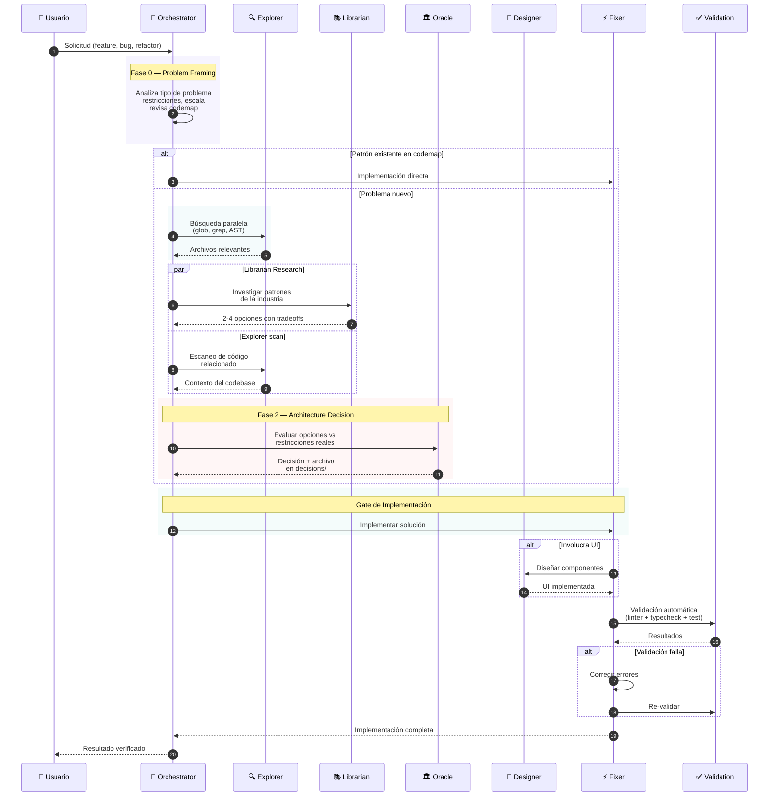
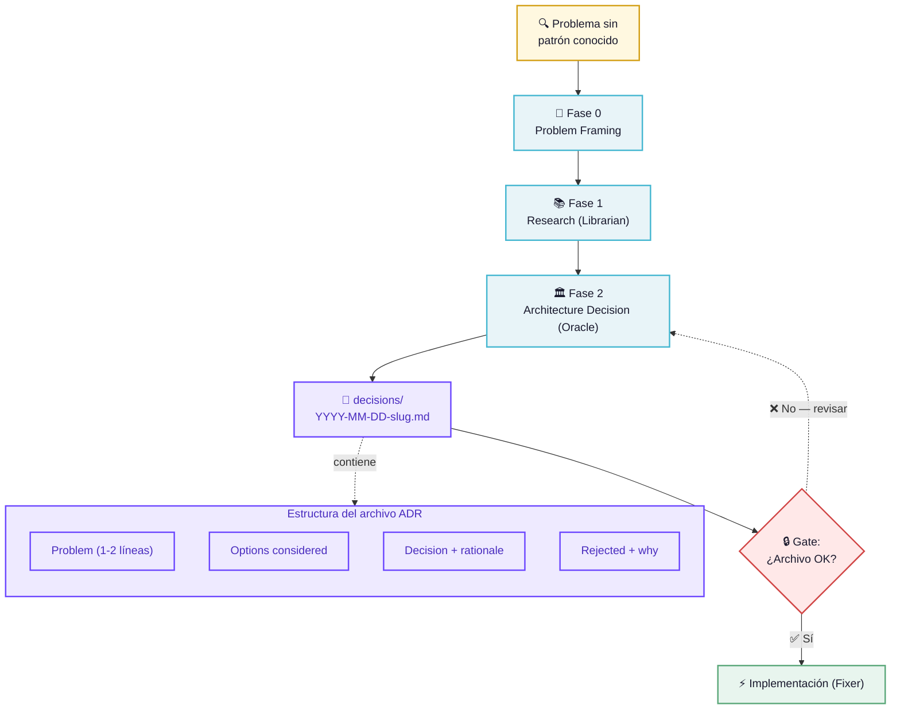
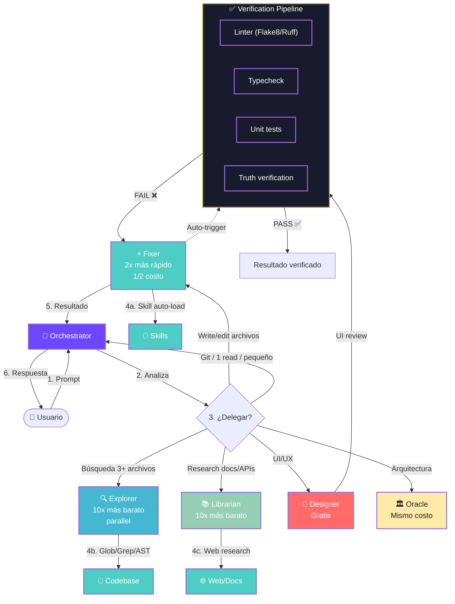
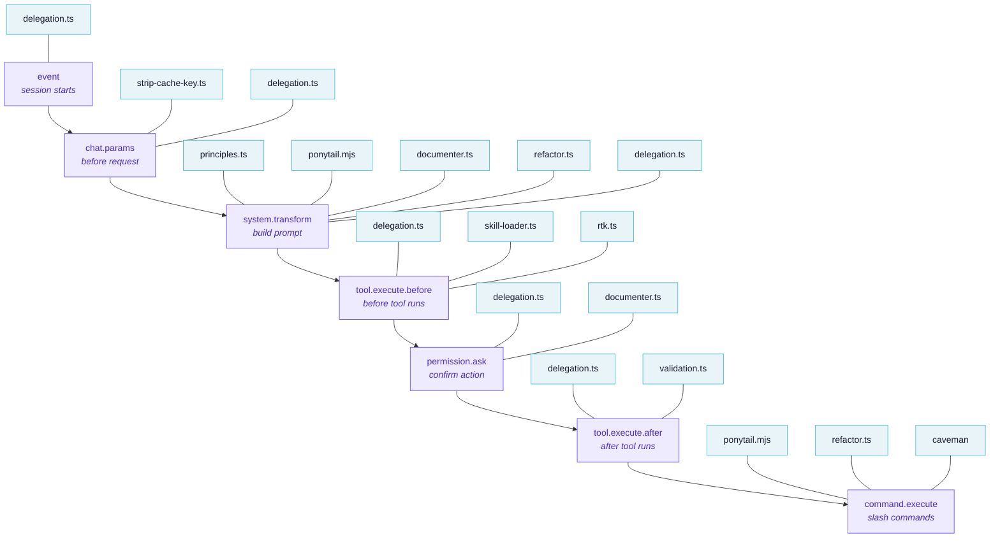
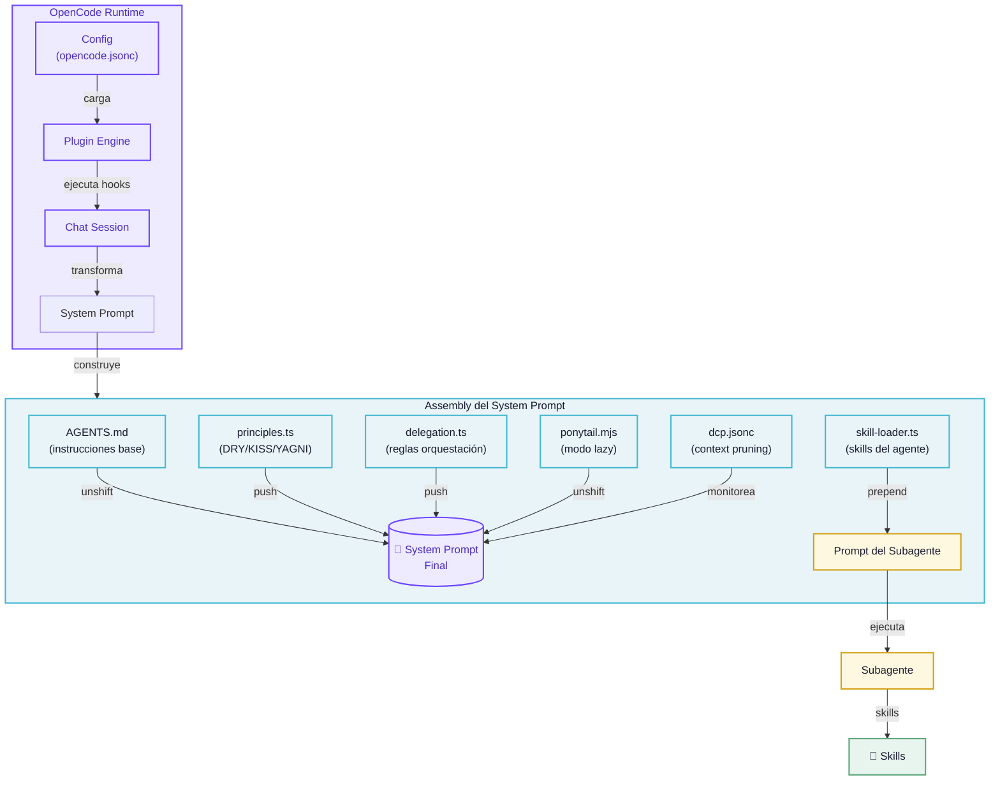

<p align="center">
  <picture>
    <source media="(prefers-color-scheme: dark)" srcset="https://img.shields.io/badge/OpenCode-Configs-6C47FF?style=for-the-badge&logo=codeium&logoColor=white&labelColor=1a1a2e">
    
  </picture>
</p>

<p align="center">
  
  
  
  
  
  
</p>

<h1 align="center">🎛️ My OpenCode Configs</h1>

<p align="center">
  <em>Configuración personal de OpenCode — orquestación multi-agente, plugins, skills, comandos y prompts para un flujo de desarrollo asistido por IA optimizado, paralelo y consistente.</em>
</p>

---

## 📋 Tabla de Contenidos

- [Arquitectura del Sistema](#-arquitectura-del-sistema)
- [Flujo de Trabajo con Agentes](#-flujo-de-trabajo-con-agentes)
- [Pipeline de Planeación](#-pipeline-de-planeación)
- [Decisiones Arquitectónicas](#-decisiones-arquitectónicas)
- [Flujo de Procesamiento de una Solicitud](#-flujo-de-procesamiento-de-una-solicitud)
- [Estructura del Proyecto](#-estructura-del-proyecto)
- [Componentes](#-componentes)
- [Comandos](#-comandos)
- [Plugins](#-plugins)
- [Skills](#-skills)
- [Modelo de Delegación](#-modelo-de-delegación-6-capas)
- [Instalación y Uso](#-instalación-y-uso)
- [Diagrama de Contexto de la Sesión](#-diagrama-de-contexto-de-la-sesión)
- [Filosofía de Diseño](#-filosofía-de-diseño)
- [Roadmap](#-roadmap--próximos-pasos)

---

## 🏗️ Arquitectura del Sistema

```mermaid
graph TB
    classDef config fill:#EEEAFF,stroke:#6C47FF,stroke-width:2px,color:#4A2DBF
    classDef plugin fill:#E8F4F8,stroke:#45B7D1,stroke-width:2px,color:#1a1a2e
    classDef agent fill:#FFF8E0,stroke:#D4A017,stroke-width:2px,color:#1a1a2e
    classDef skill fill:#E8F5EE,stroke:#5BA87A,stroke-width:2px,color:#1a1a2e
    classDef command fill:#FFE8E8,stroke:#D14545,stroke-width:2px,color:#1a1a2e

    subgraph Config["📁 Config Layer"]
        OC[opencode.jsonc<br/>Config principal]
        OH[oh-my-opencode-slim.json<br/>Preset de agentes]
        AG[AGENTS.md<br/>Instrucciones globales]
        DC[dcp.jsonc<br/>Context pruning]
        TUI[tui.json<br/>UI config]
    end

    subgraph Plugins["🔌 Plugin Layer"]
        DP[delegation.ts<br/>6-capas: tracking, block,<br/>auto-allow, prompts,<br/>hints, reminders]
        SL[skill-loader.ts<br/>Auto-carga skills<br/>por tipo de agente]
        PT[ponytail.mjs<br/>Modo lazy dev<br/>persistente]
        PR[principles.ts<br/>DRY/KISS/YAGNI<br/>en system prompt]
        VC[validation.ts<br/>Python lint+typecheck<br/>automático]
        RT[rtk.ts<br/>Optimización de<br/>comandos bash]
        SK[strip-cache-key.ts<br/>Compatibilidad<br/>de providers]
        CV[caveman/<br/>plugin.js]
        DR[documenter.ts<br/>Skills documentación]
        RF[refactor.ts<br/>Skills refactoring]
    end

    subgraph Agents["🤖 Agent Layer"]
        ORQ[Orchestrator<br/>Router principal<br/>write:deny / edit:deny]
        FX[fixer<br/>Implementación<br/>rápida]
        DG[designer<br/>UI/UX]
        EX[explorer<br/>Búsqueda código]
        LB[librarian<br/>Research docs]
        OR[oracle<br/>Arquitectura]
        DV[documenter<br/>Documentación]
        RF2[refactor<br/>Refactoring]
    end

    subgraph Skills["🧠 Skill Layer<br/>19 skills total"]
        SK1[codemap<br/>simplify<br/>pdf]
        SK2[frontend-design<br/>design-system<br/>ui-ux-pro-max<br/>+5 más]
        SK3[fixer-code-standards<br/>oracle-decision-lens]
        SK4[documentation-writer<br/>design-doc-mermaid<br/>doc-coauthoring]
    end

    subgraph Commands["⚡ Command Layer"]
        PM[ponytail<br/>Lazy mode]
        CM[caveman<br/>Modo cavernícola]
    end

    Config -->|carga| Plugins
    Plugins -->|inyecta| Agents
    Agents -->|usa| Skills
    Commands -->|modifica| Agents

    class OC,OH,AG,DC,TUI config
    class DP,SL,PT,PR,VC,RT,SK,CV,DR,RF plugin
    class ORQ,FX,DG,EX,LB,OR,DV,RF2 agent
    class SK1,SK2,SK3,SK4 skill
    class PM,CM command
```



---

## 🔄 Flujo de Trabajo con Agentes



---

## 📐 Pipeline de Planeación

```mermaid
flowchart LR
    classDef phase fill:#EEEAFF,stroke:#6C47FF,stroke-width:2px,color:#4A2DBF
    classDef research fill:#E8F4F8,stroke:#45B7D1,stroke-width:2px,color:#1a1a2e
    classDef decision fill:#FFE8E8,stroke:#D14545,stroke-width:2px,color:#1a1a2e
    classDef success fill:#E8F5EE,stroke:#5BA87A,stroke-width:2px,color:#1a1a2e
    classDef gate fill:#FFF8E0,stroke:#D4A017,stroke-width:2px,color:#1a1a2e

    Start(["📝 Solicitud"]) --> F0
    
    subgraph F0["Fase 0 — Problem Framing (Orquestador)"]
        direction TB
        T1["Tipo de problema<br/>CRUD / pipeline / integración / UI"]
        T2["Restricciones reales<br/>escala / latencia / mantenedor / vida útil"]
        T3["Consultar codemap<br/>¿patrón existente?"]
    end
    
    F0 --> Check{"¿Patrón<br/>previo<br/>aplicable?"}
    
    Check -->|"Sí ✅"| Direct["Saltar Fase 1 y 2<br/>→ Directo a Fixer"]
    Check -->|"No ❌"| F1
    
    subgraph F1["Fase 1 — Research (Librarian)"]
        direction TB
        R1["Brief con: problema + restricciones"]
        R2["Buscar prior art:<br/>foros / RFCs / blogs de ingeniería"]
        R3["Output: 2-4 opciones<br/>con tradeoffs explícitos"]
    end
    
    F1 --> F2
    
    subgraph F2["Fase 2 — Architecture Decision (Oracle)"]
        direction TB
        D1["Comparar opciones vs<br/>restricciones reales"]
        D2["Output obligatorio:<br/>decisions/YYYY-MM-DD-slug.md"]
        D3["Contenido: Problem, Options,<br/>Decision + rationale, Rejected"]
    end
    
    F2 --> Gate{"Gate de<br/>Implementación"}
    
    Gate -->|"Archivo decisión OK ✅"| Impl["→ Fixer implementa"]
    Gate -->|"Sin archivo ❌"| Block["BLOQUEADO<br/>Crear decisión primero"]
    
    Direct --> Impl
    
    Impl --> End(["✅ Hecho"])

    class F0 phase
    class T1,T2,T3 phase
    class F1 research
    class R1,R2,R3 research
    class F2 decision
    class D1,D2,D3 decision
    class Direct,Impl,End success
    class Check,Gate gate
    class Block gate
```



---

## 📋 Decisiones Arquitectónicas

El directorio `decisions/` es el repositorio de registros de decisión arquitectónica (ADR). Cada vez que el **Pipeline de Planeación** detecta un problema sin patrón previo, el flujo documenta la decisión en un archivo con marca de tiempo.

Este archivo no solo justifica *qué* se decidió, sino *por qué* — atado a las restricciones reales del proyecto, no a preferencias abstractas.



> **Regla:** `@fixer` no puede implementar una feature no-trivial sin un archivo de decisión correspondiente. Si el archivo existe pero es más viejo que cambios en el codemap del módulo afectado, la decisión debe revisarse.

---

## ⚙️ Flujo de Procesamiento de una Solicitud



---

## 📁 Estructura del Proyecto

```
MyOpencodeConfigs/
├── 📄 opencode.jsonc            # Config principal — plugins, agentes, MCPs, permisos
├── 📄 oh-my-opencode-slim.json  # Preset de agentes — modelos, skills, MCPs
├── 📄 AGENTS.md                 # Instrucciones globales para todos los agentes
├── 📄 dcp.jsonc                 # Dynamic Context Pruning — gestión de contexto
├── 📄 tui.json                  # Configuración de UI
├── 📄 package.json              # Dependencia @opencode-ai/plugin
│
├── 🤖 agents/                   # Definiciones de agentes personalizados
│   ├── documenter.md
│   └── refactor.md
│
├── ⚡ commands/                 # Comandos slash (/caveman, /ponytail, ...)
│   ├── caveman.md
│   ├── caveman-commit.md
│   ├── caveman-review.md
│   ├── ponytail.md
│   ├── ponytail-review.md
│   ├── ponytail-audit.md
│   ├── ponytail-debt.md
│   └── ponytail-help.md
│
├── 🔌 plugins/                  # Plugins OpenCode (TypeScript/ESM)
│   ├── delegation.ts           # 6 capas de orquestación + circuit breaker
│   ├── skill-loader.ts         # Auto-carga de skills por agente
│   ├── ponytail.mjs            # Persistencia del modo lazy
│   ├── principles.ts           # Inyección DRY/KISS/YAGNI
│   ├── validation.ts           # Validación automática Python
│   ├── rtk.ts                  # Optimización de comandos bash
│   ├── strip-cache-key.ts      # Compatibilidad con providers
│   ├── documenter.ts           # Skills de documentación
│   ├── refactor.ts             # Skills de refactoring
│   └── caveman/                # Plugin modo cavernícola
│
├── 💬 prompts/                  # Prompts reutilizables
│   ├── build.md
│   ├── validate-code.md
│   └── verify-truth.md
│
├── 🧠 skills/                   # 19 skills especializados
│   ├── codemap/                # Mapas de código
│   ├── simplify/               # Simplificación de código
│   ├── pdf/                    # Procesamiento PDF
│   ├── refactor/               # Refactoring quirúrgico
│   ├── design-doc-mermaid/     # Diagramas Mermaid
│   ├── documentation-writer/   # Documentación Diátaxis
│   ├── frontend-design/        # Diseño frontend
│   ├── design-system/          # Sistemas de diseño
│   ├── design/                 # Diseño general
│   ├── banner-design/          # Banners
│   ├── brand/                  # Branding
│   ├── slides/                 # Presentaciones
│   ├── ui-styling/             # Estilos UI
│   ├── ui-ux-pro-max/          # UX avanzado
│   ├── webapp-testing/         # Testing web
│   ├── xlsx/                   # Excel/Spreadsheets
│   ├── doc-coauthoring/        # Coautoría docs
│   └── oracle-decision-lens/   # Decisiones arquitectura
│
├── 📜 scripts/                  # Scripts auxiliares
│   ├── opencode-slim-patched-dist.mjs
│   └── patch-plugin.mjs
│
└── 📋 decisions/                # Archivos de decisión arquitectónica (ADR)
```

---

## 🧩 Componentes

### 🤖 Agentes

| Agente | Modelo(s) | Skills | Costo | Rol |
|--------|-----------|--------|-------|-----|
| **Orchestrator** | `deepseek-v4-flash-free` | codemap, pdf, simplify | — | Router principal. Analiza, delega, verifica. |
| **Fixer** | `deepseek-v4-flash-free` | fixer-code-standards, codemap, simplify | ½ costo | Implementación rápida, writes/edits. |
| **Explorer** | `deepseek-v4-flash-free` | — | ¹⁄₁₀ costo | Búsqueda de código (glob, grep, AST). |
| **Librarian** | `deepseek-v4-flash-free` | — | ¹⁄₁₀ costo | Research de documentación y APIs. |
| **Designer** | `mimo-v2.5-free` → `deepseek-v4-flash-free` | frontend-design, banner-design, brand, design, design-system, slides, ui-styling, ui-ux-pro-max | **Gratis** | UI/UX, componentes visuales. |
| **Oracle** | `nemotron-3-ultra-free` → `deepseek-v4-flash-free` | simplify, oracle-decision-lens | Mismo | Arquitectura, decisiones, code review. |
| **Documenter** | `deepseek-v4-flash-free` | simplify, doc-coauthoring, documentation-writer, design-doc-mermaid, pdf | — | Documentación técnica. |
| **Validator** | `deepseek-v4-flash-free` | codemap, simplify | — | Verificación de verdad (anti-hallucination). |
| **Observer** | `mimo-v2.5-free` → `deepseek-v4-flash-free` | — | — | Observabilidad. |

### 🔌 Plugins y Hooks

Cada plugin se conecta a uno o más hooks del ciclo de vida de OpenCode. El diagrama siguiente muestra cómo los plugins intervienen en cada etapa de la ejecución:



### 🔌 Tabla de Plugins

| Plugin | Hooks | Función |
|--------|-------|---------|
| **delegation** | 7 hooks | Orquestación multi-agente: tracking de sesiones, bloqueo de re-delegación, auto-allow bash, system prompts, hints, reminders + circuit breaker |
| **skill-loader** | `tool.execute.before` | Lee `oh-my-opencode-slim.json` y auto-carga skills en el prompt del subagente |
| **ponytail** | `system.transform`, `command.execute` | Inyecta y persiste el modo lazy senior dev (`/ponytail lite\|full\|ultra\|off`) |
| **principles** | `system.transform` | Inyecta DRY/KISS/YAGNI + Consistencia en el prompt de TODOS los agentes |
| **validation** | `tool.execute.after` | Valida automáticamente archivos `.py` (syntax + ruff/flake8) tras write/edit |
| **rtk** | `tool.execute.before` | Reescribe comandos bash con `rtk` para ahorrar tokens |
| **strip-cache-key** | `chat.params` | Elimina `promptCacheKey` para compatibilidad con providers estrictos |
| **documenter** | `system.transform`, `permission.ask` | Inyecta skills de documentación y restringe writes a archivos .md/.mmd |
| **refactor** | `system.transform`, `command.execute` | Inyecta skill de refactoring al detectar `@refactor` |
| **caveman** | `command.execute` | Modo cavernícola — respuestas ultra-tersas |

### ⚡ Comandos (Slash)

| Comando | Descripción |
|---------|-------------|
| `/caveman [level]` | Activa modo cavernícola — respuestas ultra-tersas |
| `/caveman-commit` | Genera mensaje de commit estilo caveman (Conventional Commits) |
| `/caveman-review` | Code review estilo caveman — una línea por hallazgo |
| `/ponytail [level]` | Activa modo lazy senior dev (lite/full/ultra/off) |
| `/ponytail-review` | Review de over-engineering — qué se puede borrar |
| `/ponytail-audit` | Auditoría de deuda técnica |
| `/ponytail-debt` | Reporte de deuda técnica |
| `/ponytail-help` | Ayuda del modo ponytail |

---

## 🏛️ Modelo de Delegación (6 Capas)

El plugin `delegation.ts` implementa un sistema de 6 capas para garantizar que la orquestación sea eficiente, económica y libre de loops:

```mermaid
flowchart LR
    classDef tracking fill:#EEEAFF,stroke:#6C47FF,stroke-width:2px,color:#4A2DBF
    classDef block fill:#FFE8E8,stroke:#D14545,stroke-width:2px,color:#1a1a2e
    classDef auto fill:#E8F5EE,stroke:#5BA87A,stroke-width:2px,color:#1a1a2e
    classDef prompt fill:#E8F4F8,stroke:#45B7D1,stroke-width:2px,color:#1a1a2e
    classDef hint fill:#FFF8E0,stroke:#D4A017,stroke-width:2px,color:#1a1a2e
    classDef breaker fill:#FFE8E8,stroke:#D14545,stroke-width:2px,color:#1a1a2e

    subgraph L1["1a: Event Tracking"]
        EV["event → session.created<br/>Rastrea padre→hijo"]
    end
    subgraph L1b["1b: Agent Tracking"]
        CM["chat.message → sessionID→agent name"]
    end
    subgraph L2["2: HARD BLOCK 🚫"]
        TB["tool.execute.before<br/>Sabotea args de task/subtask<br/>para subagentes"]
    end
    subgraph L3["3: Auto-Allow"]
        PA["permission.ask → bash<br/>Prevents headless hangs"]
    end
    subgraph L4["4: System Prompts"]
        ST["system.transform →<br/>reglas de delegación en XML"]
    end
    subgraph L5["5: Tool Hints"]
        TD["tool.definition →<br/>hints de delegación en descripciones"]
    end
    subgraph L6["6: Reminders + Breaker"]
        TA["tool.execute.after →<br/>reminders post-hoc +<br/>circuit breaker de fixer"]
    end

    L1 --> L1b --> L2 --> L3 --> L4 --> L5 --> L6

    class L1,L1b tracking
    class L2 block
    class L3 auto
    class L4 prompt
    class L5 hint
    class L6 breaker
```



---

## 🚀 Instalación y Uso

### Prerrequisitos

- [OpenCode](https://opencode.ai) instalado
- Node.js ≥ 18

### Instalación

```bash
# Clonar el repositorio
git clone https://github.com/Luisarg03/MyOpencodeConfigs.git
cd MyOpencodeConfigs

# Instalar dependencias
npm install
```

### Configuración

Este repo está diseñado para usarse como carpeta de config global de OpenCode en `~/.config/opencode/`, o bien referenciarse desde tu `opencode.jsonc`:

```jsonc
{
  "plugin": [
    "oh-my-opencode-slim",
    "./plugins/delegation.ts",
    "./plugins/skill-loader.ts",
    "./plugins/ponytail.mjs",
    "./plugins/principles.ts",
    "./plugins/validation.ts",
    "./plugins/rtk.ts",
    "./plugins/strip-cache-key.ts",
    "./plugins/documenter.ts",
    "./plugins/refactor.ts",
    "./plugins/caveman/plugin.js"
  ],
  "instructions": ["./AGENTS.md"]
}
```

### Variables de Entorno

| Variable | Requerida | Descripción |
|----------|-----------|-------------|
| `CONTEXT7_API_KEY` | Solo para MCP Context7 | API key para el MCP opcional de Context7 |

### Comandos Rápidos

```bash
# Modo lazy (no escribas código que no hace falta)
/ponytail full

# Modo cavernícola (respuestas ultra-tersas)
/caveman

# Code review anti-overengineering
/ponytail-review

# Generar commit message
/caveman-commit
```

---

## 🧠 Filosofía de Diseño

Este proyecto sigue tres principios fundamentales, inyectados en el system prompt de todos los agentes vía `principles.ts`:

| Principio | Descripción |
|-----------|-------------|
| **DRY** | Cada pieza de conocimiento tiene una representación única. Código duplicado → extraer. |
| **KISS** | La solución más simple que funciona es la mejor. Claridad > ingenio. |
| **YAGNI** | No agregues funcionalidad hasta que sea estrictamente necesaria. Cada línea es un pasivo. |

Además, el modo **ponytail** (lazy senior dev) añade una escalera de 6 preguntas antes de escribir cualquier código:

1. ¿Esto necesita construirse? (YAGNI)
2. ¿La stdlib lo hace? Usarla.
3. ¿Una feature nativa de la plataforma lo cubre? Usarla.
4. ¿Una dependencia ya instalada lo resuelve? Usarla.
5. ¿Puede ser una línea? Hacerlo una línea.
6. Solo entonces: escribir el mínimo código que funciona.

---

## 📊 Diagrama de Contexto de la Sesión



---

## 🛣️ Roadmap / Próximos Pasos

- [ ] Más skills especializados (testing, seguridad, DevOps)
- [ ] Integración con más MCPs externos
- [ ] Pipeline de CI/CD para validar configs
- [ ] Template de decisiones arquitectónicas pre-rellenado
- [ ] Dashboard de estadísticas de uso de agentes

---

<p align="center">
  <sub><strong>MyOpencodeConfigs</strong> · <a href="https://github.com/Luisarg03/MyOpencodeConfigs">github.com/Luisarg03/MyOpencodeConfigs</a> · Built with ❤️ for OpenCode</sub>
</p>
<p align="center">
  <sub>Documentación estructurada según <a href="https://diataxis.fr/">Diátaxis</a> (Tutorial · How-to · Reference · Explanation) · Diagramas con Mermaid</sub>
</p>
