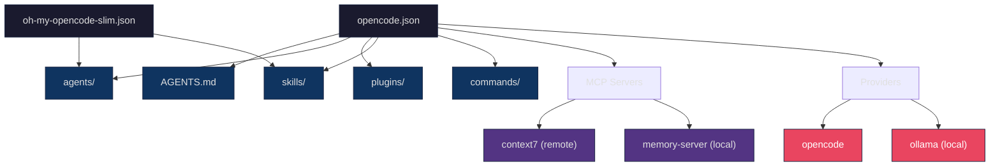

# MyOpencodeConfigs

A public reference mirror of a power-user [opencode](https://opencode.ai) configuration. Not a package. Clone, read, adapt.

## Architecture

```mermaid
flowchart TD
    OC["opencode.json"]
    AG["AGENTS.md"]
    AM["agents/"]
    PL["plugins/"]
    SK["skills/"]
    CM["commands/"]
    MCP["MCP Servers"]
    P["Providers"]
    OH["oh-my-opencode-slim.json"]

    OC --> AG
    OC --> AM
    OC --> PL
    OC --> SK
    OC --> CM
    OC --> MCP
    OC --> P
    OH --> AM
    OH --> SK

    MCP --> C7["context7 (remote)"]
    MCP --> MEM["memory-server (local)"]

    P --> OC_P["opencode"]
    P --> OL["ollama (local)"]

    classDef root fill:#1a1a2e,color:#e0e0e0,stroke:#16213e
    classDef config fill:#0f3460,color:#e0e0e0,stroke:#16213e
    classDef mcp fill:#533483,color:#e0e0e0,stroke:#16213e
    classDef provider fill:#e94560,color:#ffffff,stroke:#16213e

    class OC,OH root
    class AG,AM,PL,SK,CM config
    class C7,MEM mcp
    class OC_P,OL provider
```

## Layout

| Path | Purpose |
|---|---|
| `opencode.json` | Main config: providers, plugins, MCP servers, instructions |
| `AGENTS.md` | Global agent instructions: philosophy, pipelines, rules |
| `agents/` | Custom subagent definitions (cavecrew-builder, cavecrew-investigator, cavecrew-reviewer) |
| `plugins/` | Local plugins: caveman, delegation, skill-loader, notification, opendashboard, rtk |
| `skills/` | 33 skill bundles: caveman family, design system, codemap, simplify, deepwork, and more |
| `commands/` | 7 slash commands: caveman-commit, caveman-compress, caveman-help, opendashboard, etc. |
| `oh-my-opencode-slim.json` | Preset profiles: go-work, zen-work, copilot-work, local-cloud-work |
| `tui.json` | TUI theme config |

## Notable features

- **Caveman mode** — token compression system that strips filler while preserving technical accuracy. Multiple intensity levels (lite/full/ultra/wenyan). Saves ~65% output tokens.
- **Delegation plugin** — orchestrator-to-subagent routing with role-based write permissions. Prevents expensive agents from touching files directly.
- **Skill system** — 20+ skill bundles loaded per-session via `skill-loader.ts`. Each skill injects domain-specific instructions, scripts, and reference data into the agent context.
- **OpenDashboard** — local dashboard server spawned on port 8420 (env-overridable `OPENDASHBOARD_REPO`). Live session monitoring.
- **Multi-provider + MCP** — dual providers (opencode cloud + local ollama), remote Context7 for docs lookup, local memory-server via uv for cross-session knowledge.

## Getting started

This repo is a reference, not an installable package.

1. Clone the repo
2. Read `AGENTS.md` to understand the agent philosophy and planning pipeline
3. Study `opencode.json` for config structure: providers, plugins, MCP setup
4. Browse `skills/` and `plugins/` for patterns worth adapting
5. Copy individual files or directories into your own `~/.config/opencode/`

The `oh-my-opencode-slim.json` presets show how to configure per-agent model assignments, skill loading, and MCP access per workflow.
